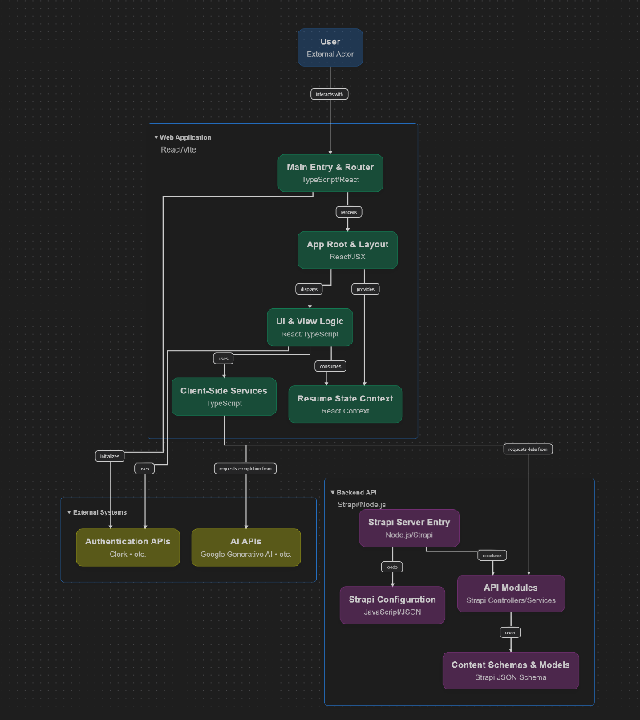

# 🚀 ResumeForge – AI-Powered Resume Builder

**ResumeForge** is a full-stack, modern web application that enables users to create **ATS-friendly**, professional resumes and cover letters. It offers a wide range of pre-designed static resume templates, a powerful resume builder with editable templates, and an AI-based job description analyzer that suggests tailored enhancements to optimize resume performance.

---
## ❯ Work Flow
<div align="center">




<em></em>

<!-- BADGES -->
<!-- local repository, no metadata badges. -->

<em>Built with the tools and technologies:</em>


<br>


</div>

## 📦 Tech Stack

- **Frontend:** React, TypeScript, Vite
- **Styling:** CSS, styled-components
- **Routing:** React Router
- **Backend CMS:** Strapi
- **Authentication:** Auth0 (via Clerk)
- **Database:** Supabase (Vercel-hosted)
- **API Integration:** Axios
- **Linting & Formatting:** ESLint
- **Other:** JSON, JavaScript

---

## ✨ Features

- ✅ **Pre-designed Static Resume and CV Templates**  
  Professionally crafted templates to make a lasting impression.

- 🧰 **Custom Resume Builder**  
  Choose between two-column, single-column, and multi-page layouts.

- 🎨 **Style Personalization**  
  Change fonts, background colors, and layout to match your personal branding.

- 🧠 **AI Job Description Analyzer**  
  Paste a job description and get keyword recommendations to improve ATS scores.

- 🔐 **User Authentication**  
  Secure login and session management using Clerk (Auth0).

- ☁️ **Strapi-powered CMS**  
  Dynamically serves resume templates and static content.

- 💾 **Save & Download**  
  Download resumes and cover letters in clean PDF format.

---

## 💼 Why Use ResumeForge?

- Expertly crafted templates that help you make a lasting impression
- Simple to edit and customize with clear instructions
- Keyword-optimized to improve your chances of getting through ATS filters
- Built for developers, marketers, designers, and all modern job seekers

---

## 🧪 Installation & Setup

```bash
# Clone the repository
git clone https://github.com/VashistaRK/Forge.git

# Install dependencies
cd Forge
npm install

# Start development server
npm run dev
