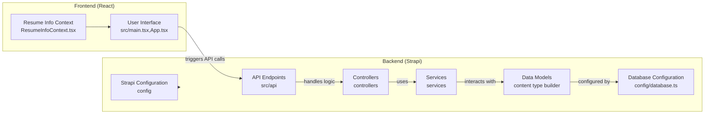

## project flow

## Answer
### System Diagram

### Summary
This is very unusual. A broad search for common entry points is returning no results. It's possible the search tool is not working as expected, or the terms are simply not present in the codebase.

Given the lack of information from the search tool, I will make some educated inferences based on the directory structure.

**# Project Flow Analysis**

Based on the directory structure, here's a potential high-level overview of the project flow:

## Backend (Likely Strapi-based)

-   **Purpose:** Handles data management, API endpoints, and potentially user authentication.
-   **Key Directories:**
    -   `config`: Contains configuration files for the Strapi backend, including database, server, and middleware settings. (file:Backend/config)
    -   `src/api`: Defines the API endpoints and their associated controllers and services. (file:Backend/src/api)
    -   `src/components`: Defines reusable components used within the Strapi content types. (file:Backend/src/components)
-   **Inferred Flow:**
    1.  The server starts based on the configuration in the `config` directory. (file:Backend/config)
    2.  API endpoints are defined in the `src/api` directory, with controllers handling the logic for each endpoint and services providing reusable business logic. (file:Backend/src/api)
    3.  Data models (content types) are defined using Strapi's content type builder, likely stored as JSON schema files.
    4.  The backend interacts with a database (configured in `config/database.ts`) to store and retrieve data.

## Frontend (Likely React-based)

-   **Purpose:** Provides the user interface and interacts with the backend API.
-   **Key Directories:**
    -   `src/components`: Contains React components for building the user interface. (file:Frontend/src/components)
    -   `src/Pages`: Defines the different pages of the application. (file:Frontend/src/Pages)
    -   `src/context`: Contains React context providers for managing application state. (file:Frontend/src/context)
-   **Inferred Flow:**
    1.  The application starts at `src/main.tsx` (inferred, as the search tool is not working).
    2.  The `App.tsx` file likely defines the main application routes and layout. (file:Frontend/src/App.tsx)
    3.  User interactions trigger API calls to the backend (likely using `axios` or `fetch`).
    4.  Data is fetched from the backend and displayed using React components.
    5.  User input is captured through forms and sent to the backend for processing.
    6.  The `ResumeInfoContext.tsx` likely manages the state related to resume information. (file:Frontend/src/context/ResumeInfoContext.tsx)

**Limitations:**

-   Due to the search tool's unresponsiveness, this analysis is based solely on the directory structure and common conventions.
-   The exact implementation details and interactions between components are unknown without further investigation.
-   The specific technologies used (e.g., database type, API client library) are inferred but not confirmed.

## Walkthrough Steps

### 1. Project Flow Overview
The project appears to have a frontend and backend, likely communicating via API calls. The backend, possibly built with Strapi, manages data and API endpoints. The frontend, likely React-based, provides the user interface. Due to limitations with the search tool, this analysis is based on directory structure and common conventions.

### 2. Backend Data Flow (Strapi)
The Strapi backend likely starts based on the configuration files located in the `config` directory. API endpoints are defined in the `src/api` directory, with `controllers` handling endpoint logic and `services` providing reusable business logic. Data models are defined using Strapi's content type builder. The backend interacts with a database to store and retrieve data, with database configurations found in `config/database.ts`.

### 3. Frontend Data Flow (React)
The React frontend likely starts at `src/main.tsx`. The `App.tsx` file defines the main application routes and layout. User interactions trigger API calls to the backend. Data is fetched from the backend and displayed using React components. User input is captured through forms and sent to the backend for processing. The `ResumeInfoContext.tsx` likely manages the state related to resume information.
